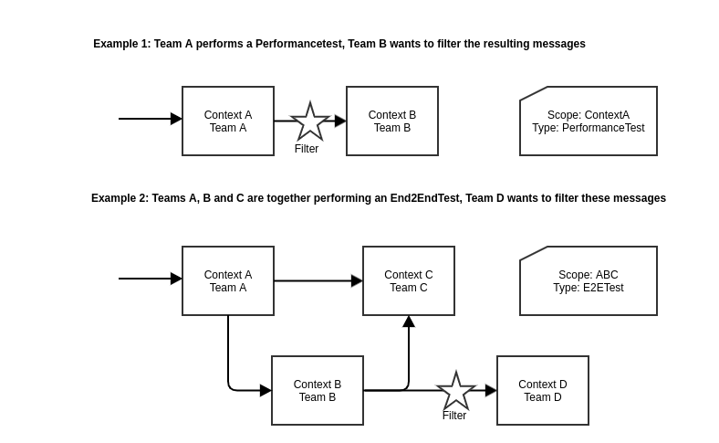

# MAY use `Test` header

API consumers and providers may use the OTTO-specific `Test` header described below to communicate that a request or response is part of a test.

Test requests are created in various contexts.
Some of them require special handling on the provider or consumer side, such as bypassing certain validations or using modified business logic during processing.
This rule defines the test header that API consumers and providers can use to identify test data.
Downstream consumers and providers must then forward this test header in subsequent processing steps, e.g. as a test extension in an asynchronous event.

This has several benefits:

- It allows for testing of certain use cases across multiple APIs.
- It enables all consumers and providers to identify and ignore hindering test data.
- It ensures data integrity of the overall system.

## `Test` header

The `Test` header is optional, but if set, it MUST be a non-empty string in the format `<test-scope>.<test-type>`.
Example: `OrderProcessing.PerformanceTest`.

| Segment  |  Description | Possible values                                                                                                                                                                                                                                                                                                                                                                                                                                                                                    | Constraints  | Example  |
|---|---|----------------------------------------------------------------------------------------------------------------------------------------------------------------------------------------------------------------------------------------------------------------------------------------------------------------------------------------------------------------------------------------------------------------------------------------------------------------------------------------------------|---|---|
| `test-scope`  | The scope of the executed test. | Possible values include but are not limited to the name of a single context or a group of contexts.                                                                                                                                                                                                                                                                                                                                                                                                | Must not contain a `.` (dot).  | OrderProcessing  |
| `test-type`  | The type of the test. | The following common types are defined:  - `PerformanceTest`: Automatically created test data in large scale.  - `SystemTest`: Automatically created test data for test-specific business cases within one team. - `End2EndTest`: Automatically created test data to test specific business cases across multiple APIs. - `ManualTest`: Manually created data.  Additional test types may be used but must explicitly be listed in the API documentation of the API provider. | Must not contain a `.` (dot).  | PerformanceTest  |

::: warning Important
Make sure you get in touch with your consumers and downstream API providers before participating in tests with your APIs, as these could affect their system or cause unexpected costs.
:::

## Example use cases

::: references

- [MUST forward `Test` header](./must-forward-test-header.md)
- [MAY use test extension](../../../../async/format/test-extension/rules/may-use-test-extension.md)
- [MUST forward `test` context attribute](../../../../async/format/test-extension/rules/must-forward-test-context-attribute.md)
- [MAY ignore events flagged with `test` context attribute](../../../../async/format/test-extension/rules/may-ignore-events-flagged-with-test.md)
:::