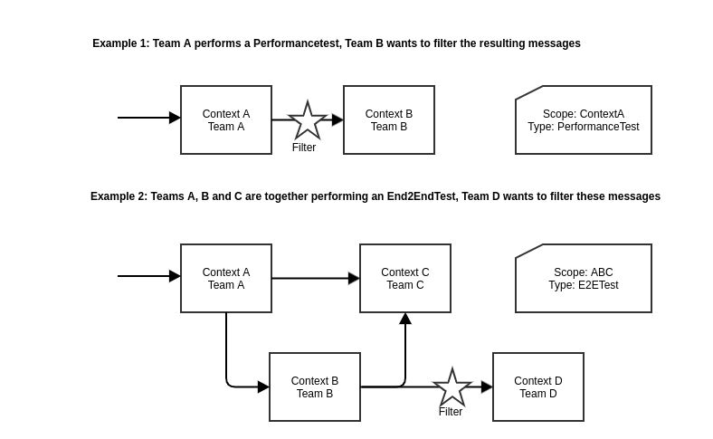

# use test extension

API providers may use the OTTO-specific test extension described within this rule to communicate that an event is a result of a test in a **non-live** environment. This enables testing certain use cases together with multiple teams while simultaneously enabling all teams to identify and ignore hindering test events.

Events **must not** be flagged with `test` in the live environment as this could negatively impact the data integrity of the overall system.

Test events are often created in various contexts. Some of them require special handling on the consumer side, such as ignoring them, bypassing specific validations, or using modified business logic while processing.

This extension defines the `test` context attribute that event producers can provide to enable consumers to handle test events alternately. The `test` attribute should be encoded like a standard cloud event attribute. Therefore, for an event encoded in kafka's binary content mode, the header name is `ce_test`.

### `test` context attribute

- Type: `String`
- Description: A string in the format `<test-scope>.<test-type>`. Both `test-type` and `test-scope` must not contain a `.` (dot).
  - `test-scope`: The scope of the executed test. Possible values include but are not limited to the name of a single context or a group of contexts (e.g., `orderprocessing`).
  - `test-type`: The type of the test. Currently, the following types are defined; additional types may be added in the future:
    - `PerformanceTest` Automatically created test events with large datasets.
    - `SystemTest` Automatically created test events to test specific business cases within one team.
    - `End2EndTest` Automatically created test events to test specific business cases within multiple teams.
    - `ManualTest` Manually created test events.
- Examples:
  - `kraken-sales-order-management.performancetest`
- Constraints:
  - OPTIONAL
  - MUST be a non-empty string in the format `<test-scope>.<test-type>`.

### Example Usages

::: references

- 
- 
- [Former specification of the test header (internal link)](https://confluence.otto.de/x/pwZxE) that was replaced by this rule
